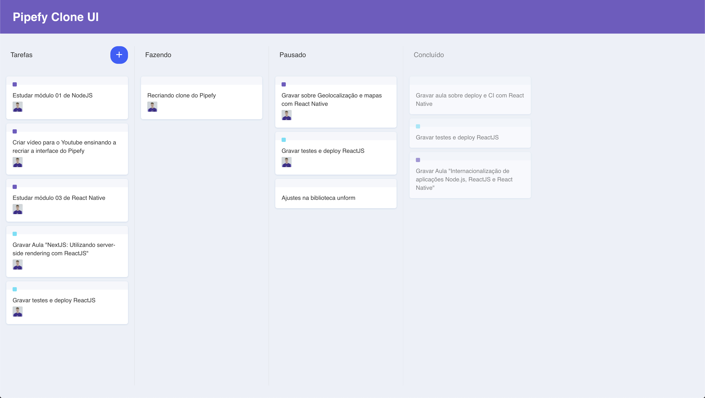

<h1 align="center">
	
</h1>

<h4 align="center"> 
	Pipefy -UI - Clone 💻 Concluído 🚀 
</h4>

<p align="center">
  
  
</p>

<p align="center">
  <a href="#bookmark-sobre">Sobre</a>&nbsp;&nbsp;&nbsp;|&nbsp;&nbsp;&nbsp;
  <a href="#rocket-tecnologias">Tecnologias</a>&nbsp;&nbsp;&nbsp;|&nbsp;&nbsp;&nbsp;
  <a href="#boom-como-executar">Como Executar</a>
</p>

## 💻 Sobre o projeto

👨🏽‍💻 Pipefy - UI - Clone - é um clone de interface do aplicativo Pipefy

Projeto desenvolvido durante uma video aula **Recriando Pipefy do zero (com drag n' drop)** oferecida pela [Rocketseat](https://www.youtube.com/watch?v=awRtgpRsdTQ&t=1865s).

---

## ⚙️ Funcionalidades

- [x] Interface do Discord

---

## 🎨 Layout

O layout da aplicação:

<p align="center">
	
</p>

---

## 🚀 Como executar o projeto

### Pré-requisitos

Antes de começar, você vai precisar ter instalado em sua máquina as seguintes ferramentas:
[Git](https://git-scm.com), [Node.js](https://nodejs.org/en/).
Além disto é bom ter um editor para trabalhar com o código como [VSCode](https://code.visualstudio.com/)

#### 🧭 Rodando a aplicação web (Frontend)

```bash

# Clone este repositório
$ git clone git@github.com:mathieus01/discord-ui-clone.git

# Acesse a pasta do projeto no seu terminal/cmd
$ cd discord-ui-clone

# Instale as dependências
$ npm install

# Execute a aplicação em modo de desenvolvimento
$ npm run start

# A aplicação será aberta na porta:3000 - acesse http://localhost:3000

```

---

## 🛠 Tecnologias

As seguintes ferramentas foram usadas na construção do projeto:

#### **Website** ([React](https://reactjs.org/) + [TypeScript](https://www.typescriptlang.org/))

---

## 🦸 Autor

 

[](https://www.linkedin.com/in/tgmarinho/)
[](mailto:tgmarinho@gmail.com)

---

## 📝 Licença

Este projeto esta sobe a licença [MIT](./LICENSE).
